# Gradient: ML/AI Practice Platform

Gradient is an interactive platform where learners implement machine-learning
algorithms from scratch. Each exercise has hidden tests that run in a sandbox,
and lessons, exercises and courses unlock one after another as the learner progresses. Learners earn XP
for a leaderboard, and a Pro plan opens the advanced course.

| Layer | Stack |
|---|---|
| Frontend (`web/`) | Next.js 16 (App Router), React 19, Tailwind CSS v4, **shadcn/ui** (Radix), **Zustand**, Monaco editor |
| Control plane (`api/`) | FastAPI, SQLite (WAL), Pydantic |
| Execution plane (`grader/`) | pytest in a resource-limited subprocess (CPU / memory / file-size rlimits, wall-clock kill) |
| Content (`exercises/`, `lessons/`) | Course order (`curriculum.json`); lessons with quizzes; exercises with starter, reference solution, hidden tests and hints |

```
Browser ──► Next.js (web) ──/api/* rewrite──► FastAPI (api) ──► grader ──► sandboxed pytest subprocess
               │ Zustand stores                     │ SQLite: users, submissions, lesson completions
               │ Monaco (self-hosted)               └ catalog + progression: ordered courses → unlocks
```

## Screenshots

All screenshots are taken from the running app during an end-to-end run. The full set is in [`docs/screenshots/`](docs/screenshots).
**Watch the animated journey:** [`docs/journey.mp4`](docs/journey.mp4) (52 s), from the landing page through a lesson, the quiz,
the first exercise, the course-complete celebration, the leaderboard and pricing.

| | |
|---|---|
| 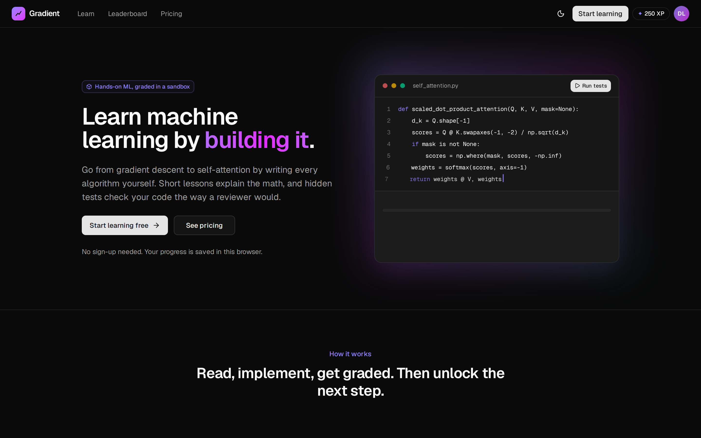 **Landing** | 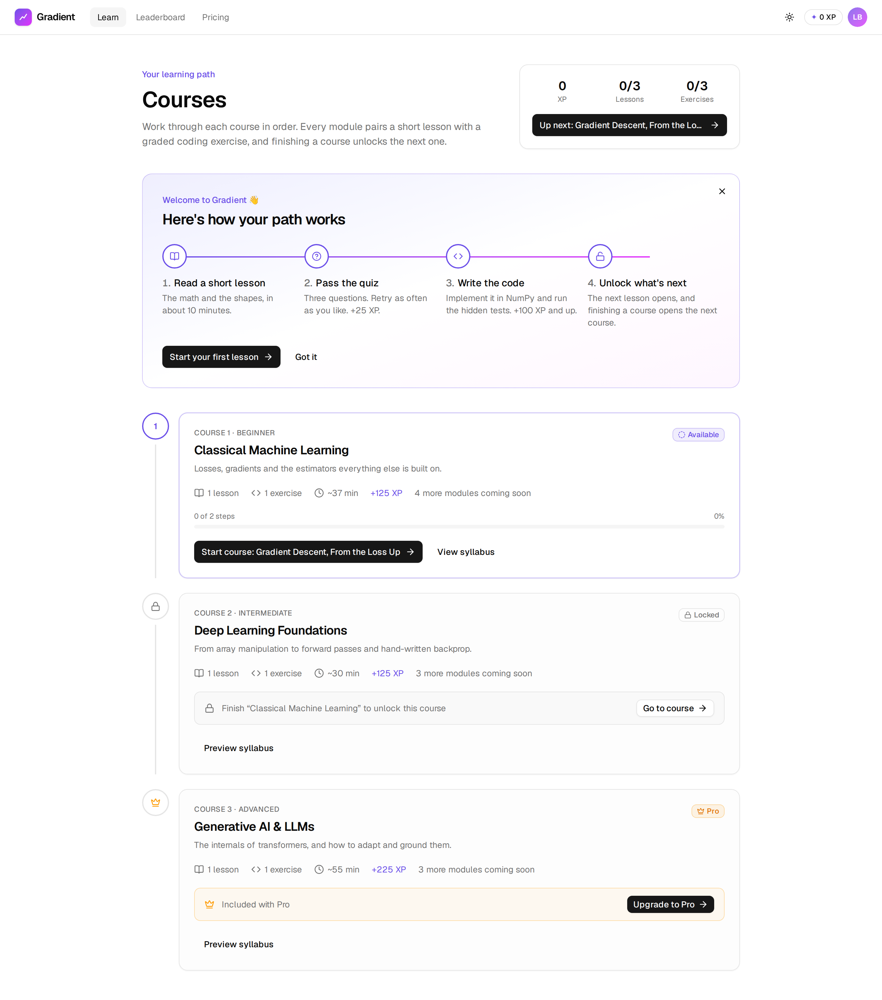 **Courses**: first-visit guide; course 2 locked, course 3 needs Pro |
| 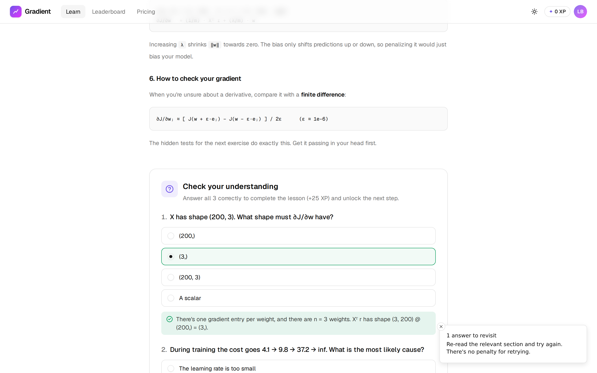 **Lesson quiz**: explanations appear only for correct answers | 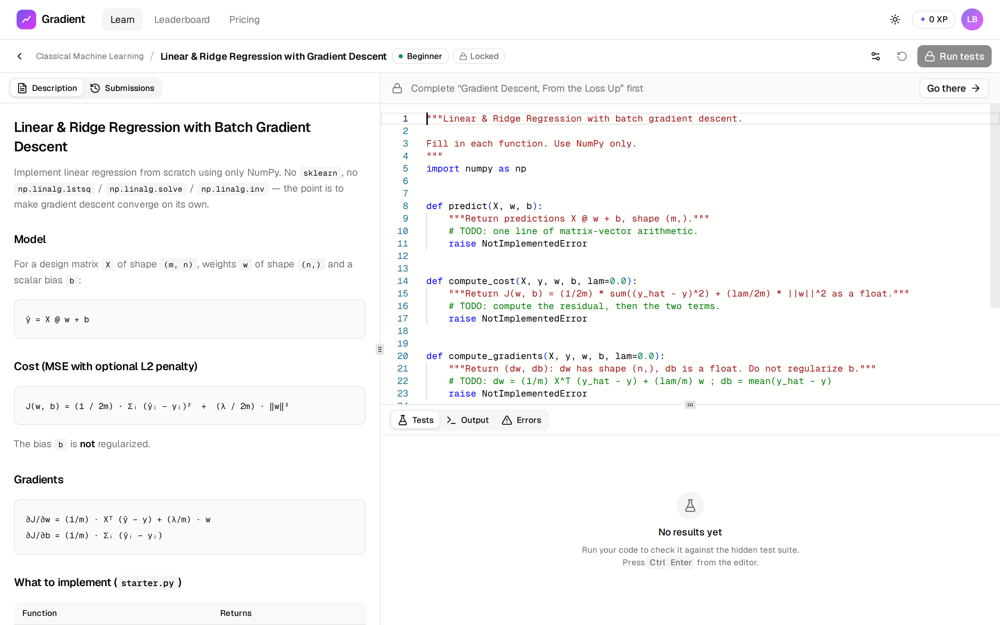 **Exercise locked** until its lesson is passed |
| 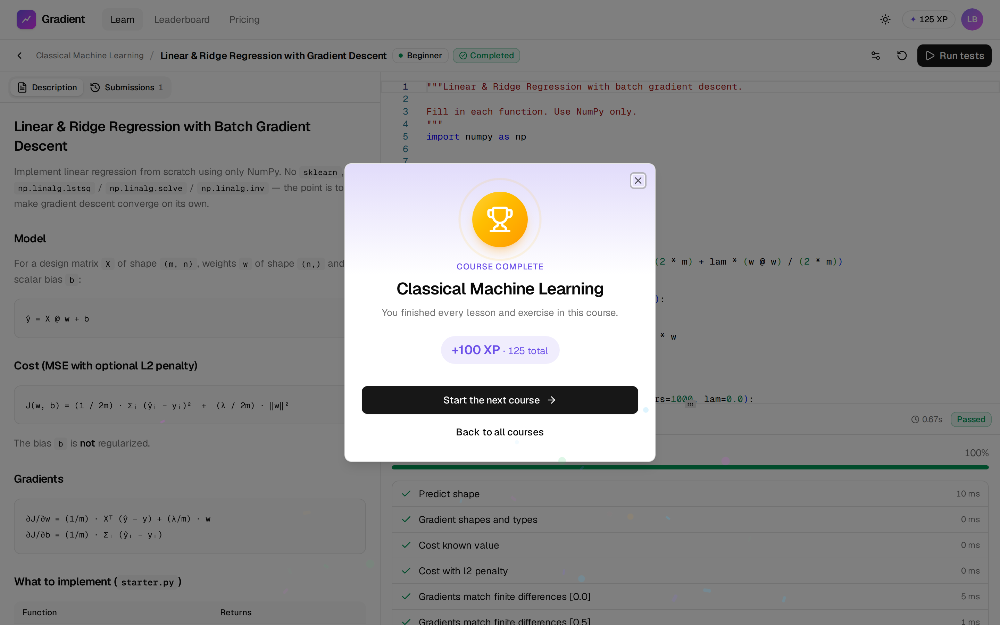 **Course complete**: celebration, then straight into the next course | 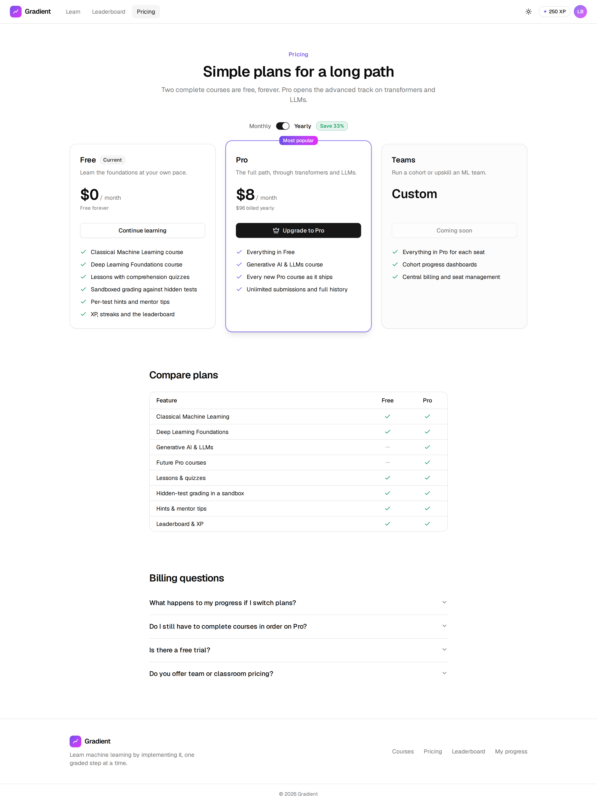 **Pricing**: monthly/yearly, comparison, FAQ |
| 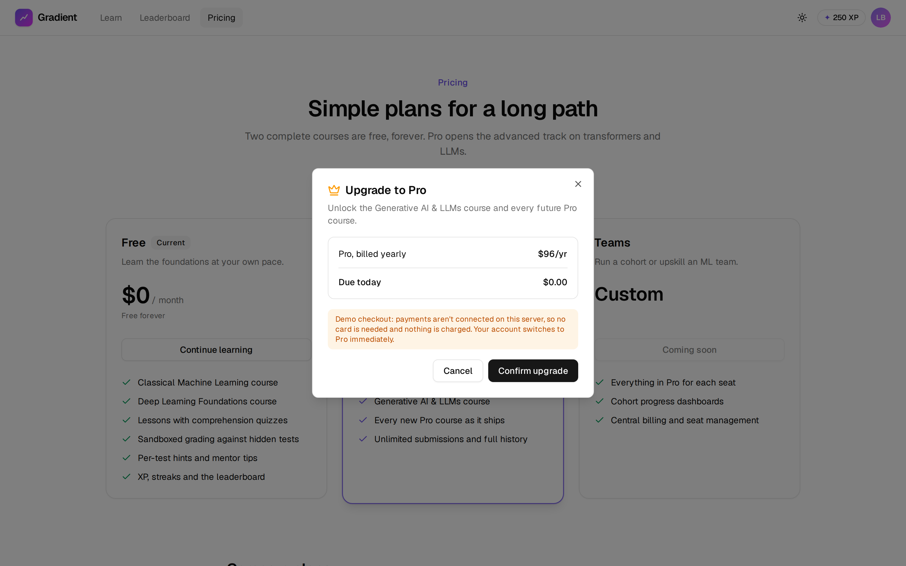 **Demo checkout**: clearly labelled, no payment | 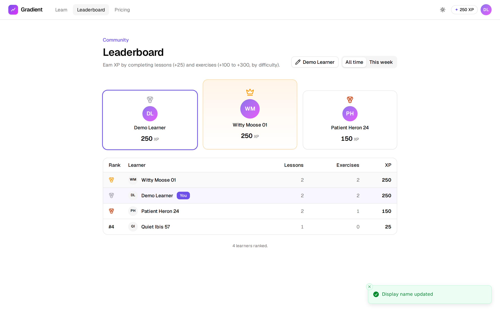 **Leaderboard**: podium, all-time/weekly, "You" row |

<p>
  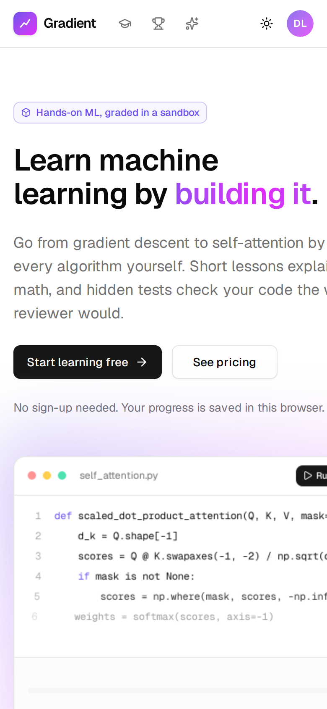
  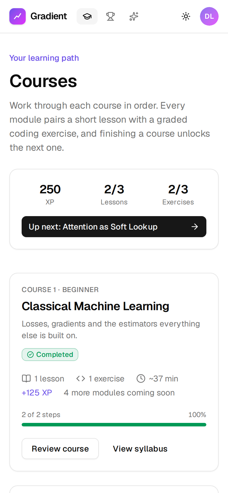
  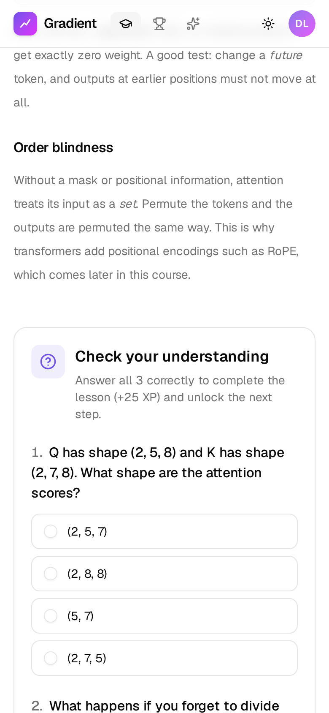
  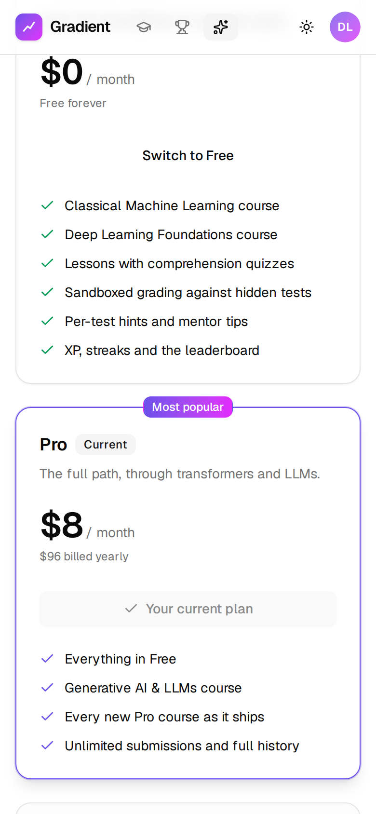
</p>

## Quick start

**Docker:**

```bash
docker compose up --build        # http://localhost:3000
```

**Local dev:**

```bash
pip install -r requirements.txt
cd web && npm install && cd ..
make api     # FastAPI on :8000 (in one terminal)
make web     # Next.js on :3000, proxies /api to :8000 (in another)
make check   # pytest + typecheck + lint
```

## Product tour

| Route | Page |
|---|---|
| `/` | **Landing**: hero with a product preview, how it works, the three-course path (live from the API), features, pricing teaser, FAQ, CTA, footer |
| `/learn` | **Courses**: the ordered path. Each course card shows status, progress, XP, and why it's locked, with the one action that unlocks it |
| `/learn/[courseId]` | **Course syllabus**: modules as a step timeline (lesson → exercise), a Continue button, coming-soon modules, and a link to the next course when this one is done |
| `/lessons/[id]` | **Lesson reader**: Markdown lesson plus a quiz. Wrong answers are flagged without revealing the right one; passing awards XP and unlocks the exercise |
| `/exercises/[id]` | **IDE workspace**: Monaco editor, hidden-test results, hints, mentor tips, history. Completion toasts link to the newly unlocked step |
| `/pricing` | **Pricing**: Free / Pro / Teams (coming soon), monthly or yearly toggle, comparison table, billing FAQ, checkout and downgrade dialogs |
| `/leaderboard` | **Leaderboard**: top-3 podium, ranked table, all-time and weekly views, your row pinned, and editing your display name |
| `/progress` | **My progress**: XP and rank, steps completed, pass rate, streak, per-course progress, activity heatmap, recent submissions |

The header shows your XP and an account menu with your name, plan, rank, progress, name editing and plan
management. Pages have light, dark and system themes, and every page works at phone width.

## Motion and the learner journey

Animation is used to explain state changes, not as decoration. It's built with [`motion`](https://motion.dev)
(the Framer Motion successor) plus a few CSS keyframes.

| Moment | What happens |
|---|---|
| Any navigation | The page eases in (CSS, so server-rendered content is never hidden waiting for JavaScript) |
| Landing | Hero copy enters in sequence. The workspace preview "types" its code, then tests tick in one by one and a hint slides open. Sections reveal on scroll |
| First visit to `/learn` | An onboarding guide draws the path: lesson → quiz → code → unlock. Dismissible, and remembered |
| Lists everywhere | Courses, modules, steps, test results, plans and leaderboard rows stagger in. Progress bars fill, and numbers count up |
| Quiz | Feedback slides open under each question. A wrong answer gives a small shake. A pass gets a spring-in success card, confetti, and the header XP counting up with a "+25" floater |
| Unlocks | Newly unlocked steps and courses glow, with a "New" / "Course unlocked" badge, until you open them |
| Course complete | A celebration dialog (trophy, XP earned, total) leads straight into the next course's first lesson, or to Pro if that course is paywalled |
| Leaderboard | The podium rises third-place first, the crown drops in, and rows cascade. Switching period re-animates |
| Navigation and buttons | The active nav pill slides between links, and buttons give subtle press feedback |

**Accessibility:** `MotionConfig reducedMotion="user"` plus `prefers-reduced-motion` CSS overrides mean
that learners who ask for reduced motion get no movement: no slides, springs, shakes, confetti or ambient
loops. Content is visible immediately. The end-to-end check verifies this, and also that entrance animations
leave no lingering `transform` behind, which would break `position: fixed` descendants.

## Sequential unlocking

`exercises/curriculum.json` is the single source of truth. Each course lists modules, and each module pairs a
`lesson` with an `exercise`. The rules live in one pure function, `api/progression.py`:

1. Within a course, steps unlock **one at a time** in order: lesson → exercise → next module's lesson → …
2. A course unlocks only when **every step of the previous course** is complete. Modules marked "coming soon"
   have no steps, so they never block.
3. A `"tier": "pro"` course also requires the **Pro plan**.

The API enforces these rules: submitting code or a quiz for a locked step returns `403` with the reason.
Paywalled lesson and exercise content is withheld. Content locked only by sequence can still be previewed.
Every lock carries a reason (`previous_step`, `previous_course` or `plan`) and the step or course to complete,
so the UI always offers the one action that unlocks it.

## XP, leaderboard and plans

- **XP:** lessons +25. Exercises +100 / +200 / +300 by difficulty (beginner / intermediate / advanced),
  awarded once, on the first pass. Rankings are by XP; on a tie, whoever got there first ranks higher. The
  weekly board counts the last 7 days.
- **Display names:** each learner gets a stable default name (e.g. "Curious Otter 42") and can rename it
  (2–24 characters, validated server-side). Learner IDs are never exposed on the board.
- **Plans:** Free covers Courses 1–2, and Pro adds Course 3 plus future Pro courses. Prices live in
  `web/src/lib/plans.ts` and are placeholders. With `BILLING_MODE=demo` (the default), checkout switches
  the plan immediately, takes no payment, and says so in the dialog. Set `BILLING_MODE=disabled` to turn
  checkout off until a payment provider (a checkout session plus a webhook that calls the same plan update)
  is wired in.

## Frontend state (Zustand)

| Store | Persisted | Holds |
|---|---|---|
| `user-store` | localStorage | Anonymous learner ID, sent as `X-User-Id` |
| `session-store` | no | Profile (`/api/me`): name, plan, XP, rank. Also rename, upgrade and cancel |
| `catalog-store` | no | Courses, progress and leaderboards (per period), with load states; `invalidate()` after any learner change |
| `lesson-store` | no | Open lesson, selected answers, quiz attempt result |
| `workspace-store` | no | Open exercise, submission history, the run in flight, latest result, active tabs |
| `editor-store` | localStorage | Per-exercise drafts, font size, minimap |

shadcn/ui components live in `web/src/components/ui/` (`components.json` is configured, so
`npx shadcn add <component>` works). Monaco and the Geist fonts are bundled locally, so builds and the
editor need no CDN.

## API

All routes take an `X-User-Id` header (8–64 characters of `[A-Za-z0-9_-]`).

| Method | Path | Description |
|---|---|---|
| GET | `/api/me` | Display name, plan, XP, rank, completion counts, billing mode |
| PATCH | `/api/me` | Rename `{display_name}` |
| POST | `/api/billing/checkout` · `/api/billing/cancel` | Switch to Pro or back to Free (`501` unless `BILLING_MODE=demo`) |
| GET | `/api/courses` · `/api/courses/{id}` | Ordered courses → modules → lesson and exercise steps, with per-learner status and lock reasons |
| GET | `/api/lessons/{id}` | Lesson Markdown and quiz questions (answers never sent), status, next step |
| POST | `/api/lessons/{id}/attempts` | Grade `{answers}`. Returns per-question results, `newly_completed`, `xp_earned` and `unlocked` steps |
| GET | `/api/exercises/{id}` | Task, starter code, status and lock reason, course, lesson and next step |
| GET / POST | `/api/exercises/{id}/submissions` | History / grade `{code}`. Returns the result plus `newly_completed`, `xp_earned` and `unlocked`. `403` if locked, `429` if a run is in flight |
| GET | `/api/progress` | XP, rank, counts, pass rate, per-course progress, per-exercise rows, recent runs, activity, next step |
| GET | `/api/leaderboard?period=all\|week` | Ranked entries plus your own row |

At startup the catalog checks that every lesson and exercise is referenced exactly once, that every reference
exists, that quiz answer indexes are valid, and that course tiers are known.

## Exercises

| Course | Lesson (quiz) | Exercise | Hidden tests |
|---|---|---|---|
| 1 · Classical ML (free) | `gradient_descent_intuition` (3 Qs) | `linear_regression_gd`: Linear & Ridge regression via gradient descent | 12 |
| 2 · Deep Learning (free) | `activations_and_backprop` (3 Qs) | `activation_functions`: ReLU (+ backward), GELU, stable softmax | 9 |
| 3 · GenAI & LLMs (Pro) | `attention_intuition` (3 Qs) | `self_attention_head`: scaled dot-product attention, causal masking | 14 |

Lessons live in `lessons/<id>/` as `lesson.json` (title, minutes), `lesson.md` and `quiz.json` (questions, answer index, explanation).

Each exercise directory contains:

- `exercise.json`: metadata, limits, remediation map and per-test hints
- `task.md`
- `starter.py`
- `solution.py`: never served
- `tests_hidden.py`: never served

**Adding a module:** create the lesson and exercise directories and reference both from a module in
`exercises/curriculum.json`. `tests/test_grader.py::test_every_hidden_test_has_a_hint`
checks that every hidden test has a hint.

Each hidden suite checks **properties** rather than one exact output, so the
common mistakes each fail a specific, explainable test:

| Bug | Caught by |
|---|---|
| Gradient sign flipped / learning rate too high | `test_cost_history_length_and_monotonic`, `test_converges_to_closed_form` |
| Wrong derivative | `test_gradients_match_finite_differences` |
| Regularizing the bias | `test_bias_is_not_regularized` |
| Calling `lstsq` / `inv` instead of descending | `test_no_forbidden_solvers` |
| Unstable softmax | `test_softmax_is_numerically_stable` (tagged `NaNInSoftmax`) |
| `K.T` instead of `swapaxes` (breaks batching) | `test_attention_batched_matches_reference` (tagged `ShapeMismatch`) |
| Missing `1/√d_k` | `test_scaling_by_sqrt_dk_is_applied` |
| Causal mask leaks future tokens | `test_causal_head_ignores_future_tokens` |

## Grading payload

```json
{
  "status": "failed",                 // passed | failed | error | timeout
  "passed_tests": 13, "total_tests": 14, "score": 0.9286,
  "tests": [{"name": "test_attention_batched_matches_reference", "outcome": "failed",
             "error_type": "ValueError", "message": "matmul: Input operand 1 has a mismatch…",
             "hint": ".T reverses every axis of a batched tensor. Swap only the last two axes.",
             "duration_ms": 0.4}],
  "stdout": "…", "stderr": "…", "duration_ms": 910,
  "error_tags": ["ShapeMismatch"],
  "remediation": [{"tag": "ShapeMismatch", "hint": "…", "exercise": "linear_regression_gd"}]
}
```

## Tests

`python -m pytest` runs 35 tests:

- **Grader:** reference solutions pass; starters fail; injected bugs are
  caught and tagged; syntax errors, CPU- and wall-clock timeouts and memory
  bombs are classified correctly.
- **API:** sequential unlocking (lesson → exercise → next course), quiz grading without leaking answers,
  the Pro paywall (including withheld content), demo checkout and downgrade, XP and leaderboard ranking,
  display-name validation, progress, and catalog validation.

CI (`.github/workflows/ci.yml`) runs these plus the frontend typecheck, lint
and production build.

## Production hardening (not in this slice)

- **Sandbox.** Learner code currently runs inside the API container (which
  compose runs read-only, with all capabilities dropped and a pid limit). It
  also shares a directory with the hidden tests and the results file. Next
  step: one network-less, non-root pod per run (gVisor, or Firecracker
  microVMs), with tests on a read-only mount the learner's UID can't read and
  results returned over the pod's exit channel.
- **Identity.** The anonymous `X-User-Id` should be replaced with real auth
  (OAuth/JWT), and per-user rate limits added.
- **Scale-out.** The per-user run lock and run semaphore are in-process, so
  the API runs one worker. To scale horizontally, move to Postgres, use Redis
  for locks and rate limits, and put a job queue in front of the execution
  plane.
- **AI mentor.** Hints are curated per test today. The next step is the
  RAG/LLM hint layer: embed the failing test, traceback and code, retrieve
  pedagogy notes, and generate guidance that never includes solution code.
